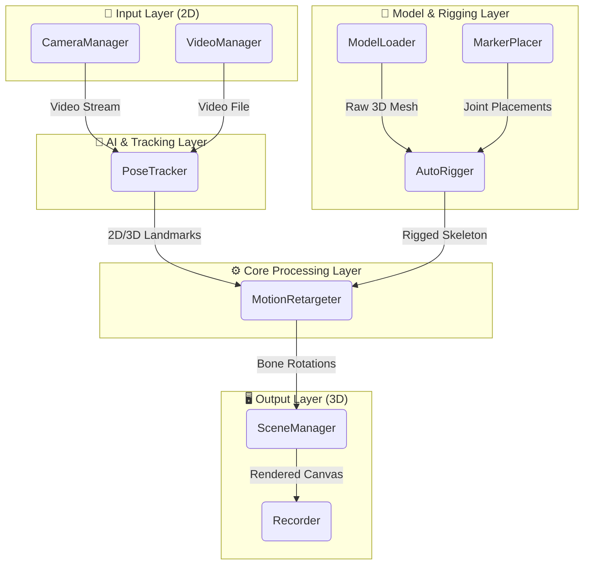

# Motion Rig 🕺🎥

Motion Rig is a powerful, browser-based auto-rigging and live motion capture application. It allows users to upload 3D models, automatically rig them, and drive their animations in real-time using a standard webcam or pre-recorded video files. 

Built entirely with modern web technologies (Three.js for 3D rendering and machine learning for pose estimation), it runs locally in your browser, ensuring high performance and data privacy.

---

## 🌟 Key Features
- **Live Motion Capture**: Track human poses in real-time using a standard webcam.
- **Video Motion Extraction**: Upload pre-recorded videos to drive 3D character animations.
- **Auto-Rigging**: Automatically detect geometry and generate skeletons for unrigged models, or instantly map existing skeletons.
- **Motion Retargeting**: Smoothly translate tracked human landmarks onto complex 3D rigs.
- **Animation Export**: Record your motion-captured sessions and export them.
- **Zero Install**: Runs entirely in the browser using WebGL and client-side AI.

---

## 🏗️ System Architecture & Data Flow

Motion Rig is built on a modular architecture to separate concerns between UI, 3D rendering, AI tracking, and mathematical retargeting. 

Here is the high-level data flow diagram showing how the modules connect:



---

## 🧩 Module Breakdown (Head to Toe)

Every script in the `src/modules/` directory plays a specific role in the pipeline:

### 1. The Entry Point
- **`main.js`**: The orchestrator. It holds the global application state, binds UI elements to functions (buttons, toggles, uploads), handles toast notifications, and wires all the specific modules together. 

### 2. The Input Modules
- **`cameraManager.js`**: Interfaces with the user's hardware webcam via the `navigator.mediaDevices` API. It requests permissions, sets up the video stream, and feeds frames to the tracker.
- **`videoManager.js`**: Handles user-uploaded video files as an alternative to live camera input. It manages video playback, scrubbing, and frame extraction.

### 3. The AI & Tracking Module
- **`poseTracker.js`**: The brains of the motion capture. It takes frames from the camera or video and runs them through a machine learning model (like MediaPipe Pose). It outputs a set of human landmarks (shoulders, elbows, knees, etc.) along with confidence scores.

### 4. The 3D & Rigging Modules
- **`modelLoader.js`**: Responsible for parsing user-uploaded 3D assets (e.g., GLTF/GLB files). It extracts the mesh data, materials, and checks if the model already contains a skeleton (skinned mesh).
- **`markerPlacer.js`**: A utility used during the auto-rigging process. It analyzes the 3D mesh geometry to intelligently guess where joints (like elbows or knees) should be placed based on bounding boxes and vertex grouping.
- **`autoRigger.js`**: If a model lacks a skeleton, this module generates one. It binds the vertices of the 3D mesh to the newly created bones (skinning), allowing the static mesh to bend and deform.

### 5. The Core Engine
- **`motionRetargeter.js`**: The most mathematically complex module. It bridges the gap between the **AI Tracking** and the **3D Rig**. It takes the raw spatial coordinates (landmarks) from `poseTracker.js`, calculates the inverse kinematics (IK) and joint angles, and applies those rotations to the bones of the rigged model. 

### 6. The Output Modules
- **`sceneManager.js`**: A wrapper around Three.js. It creates the 3D world, sets up lighting, environments (grid, wireframe), the 3D camera, and continuously renders the updated model to the screen in the animation loop.
- **`recorder.js`**: Captures the final output. It can record the Three.js canvas into a video file (WebM/MP4) or potentially export the bone transformations as animation data (like BVH/GLTF animation).

---

## 🚀 Working Procedure (Step-by-Step)

When a user interacts with the app, the following procedure occurs:

1. **Initialization**: `main.js` boots up, instantiates all modules, and initializes the Three.js scene (`sceneManager.js`).
2. **Model Import**: The user uploads a 3D model. `modelLoader.js` parses it and adds it to the scene. 
3. **Rigging**: 
   - If the model has a skeleton, `autoRigger.js` maps it to the app's standard format. 
   - If it doesn't, `markerPlacer.js` and `autoRigger.js` calculate joint positions, create bones, and weight-paint the mesh automatically.
4. **Input Selection**: The user selects either Webcam or Video mode. `cameraManager.js` or `videoManager.js` provides the video feed.
5. **Tracking Loop**: The video feed is sent to `poseTracker.js` continuously at 30-60 FPS. The AI calculates spatial landmarks.
6. **Retargeting Loop**: On every frame, `motionRetargeter.js` grabs the landmarks, computes the angles of the human body, and rotates the 3D model's bones to match.
7. **Rendering**: `sceneManager.js` updates the 3D canvas to reflect the new model pose.
8. **Exporting (Optional)**: The user clicks Record, and `recorder.js` saves the render loop output to a downloadable file.

---

## 💡 Use Cases

1. **VTubing / Virtual Avatars**: 
   Streamers can upload custom avatars and drive them live on stream using just a standard webcam, without the need for expensive motion capture suits.
   
2. **Indie Game Development**: 
   Solo developers or small teams can quickly prototype character animations. Instead of manually keyframing complex movements (like a dance or a combat roll), they can record themselves doing it and export the animation to Unity or Unreal Engine.

3. **3D Art & Pre-visualization**: 
   3D artists can upload static character sculpts. The auto-rigger allows them to quickly pose the character dynamically for rendering without having to manually construct a rig in Blender/Maya.

4. **Remote Fitness & Coaching**: 
   By visualizing human movement on a clean 3D rig, coaches can analyze biomechanics, or fitness apps can provide visual overlays for exercise routines.

---

## 💻 Installation & Usage

To run Motion Rig locally on your machine for development:

### Prerequisites
- Node.js installed

### Setup
1. Clone the repository or navigate to the folder.
2. Install dependencies:
   ```bash
   npm install
   ```
3. Start the development server (powered by Vite):
   ```bash
   npm run dev
   ```
4. Open your browser to the provided `localhost` URL.

### Building for Production
```bash
npm run build
```
The optimized files will be output to the `dist/` directory, ready to be hosted on any static web server (GitHub Pages, Vercel, Netlify).
